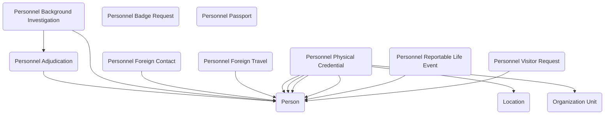

# Government Common Data Model - Personnel Security

# Entity Relationship Diagram

# Person

**Metadata**

- Schema: Contact

**Custom Fields**

# Location

**Metadata**

- Schema: govcdm_Location

**Custom Fields**

# Organization Unit

**Metadata**

- Schema: govcdm_organizationunit

**Custom Fields**

# Personnel Adjudication

**Metadata**

- Schema: govcdm_PersonnelAdjudication

**Custom Fields**

- Name
  - Type: Nvarchar
  - Schema: govcdm_Name
- Personnel Adjudication Type
  - Type: Picklist
  - Schema: govcdm_PersonnelAdjudicationType
- Subject
  - Type: Lookup
  - Schema: govcdm_Subject

# Personnel Background Investigation

**Metadata**

- Schema: govcdm_PersonnelBackgroundInvestigation

**Custom Fields**

- Name
  - Type: Nvarchar
  - Schema: govcdm_Name
- Person
  - Type: Lookup
  - Schema: govcdm_Person
- Personnel Adjudication
  - Type: Lookup
  - Schema: govcdm_PersonnelAdjudication

# Personnel Badge Request

**Metadata**

- Schema: govcdm_PersonnelBadgeRequest

**Custom Fields**

- Name
  - Type: Nvarchar
  - Schema: govcdm_Name

# Personnel Foreign Contact

**Metadata**

- Schema: govcdm_PersonnelForeignContact

**Custom Fields**

- Name
  - Type: Nvarchar
  - Schema: govcdm_Name
- Person
  - Type: Lookup
  - Schema: govcdm_Person

# Personnel Foreign Travel

**Metadata**

- Schema: govcdm_PersonnelForeignTravel

**Custom Fields**

- Name
  - Type: Nvarchar
  - Schema: govcdm_Name
- Person
  - Type: Lookup
  - Schema: govcdm_Person

# Personnel Passport

**Metadata**

- Schema: govcdm_PersonnelPassport

**Custom Fields**

- Name
  - Type: Nvarchar
  - Schema: govcdm_Name
- Passport Type
  - Type: Picklist
  - Schema: govcdm_PassportType

# Personnel Physical Credential

**Metadata**

- Schema: govcdm_PersonnelPhysicalCredential

**Custom Fields**

- Actual Return Date
  - Type: Datetime
  - Schema: govcdm_ActualReturnDate
- Approved Date
  - Type: Datetime
  - Schema: govcdm_ApprovedDate
- Expected Return Date
  - Type: Datetime
  - Schema: govcdm_ExpectedReturnDate
- Expiration Date
  - Type: Datetime
  - Schema: govcdm_ExpirationDate
- Issued By Organization Unit
  - Type: Lookup
  - Schema: govcdm_IssuedByOrganizationUnit
- Issued By Person
  - Type: Lookup
  - Schema: govcdm_IssuedByPerson
- Issued Date
  - Type: Datetime
  - Schema: govcdm_IssuedDate
- Justification
  - Type: Ntext
  - Schema: govcdm_Justification
- Location Issued
  - Type: Lookup
  - Schema: govcdm_LocationIssued
- Name
  - Type: Nvarchar
  - Schema: govcdm_Name
- Person
  - Type: Lookup
  - Schema: govcdm_Person
- Physical Credential Type
  - Type: Picklist
  - Schema: govcdm_PhysicalCredentialType
- Request Date
  - Type: Datetime
  - Schema: govcdm_RequestDate
- Requested By
  - Type: Lookup
  - Schema: govcdm_RequestedBy
- Returned To
  - Type: Lookup
  - Schema: govcdm_ReturnedTo

# Personnel Reportable Life Event

**Metadata**

- Schema: govcdm_PersonnelReportableLifeEvent

**Custom Fields**

- Name
  - Type: Nvarchar
  - Schema: govcdm_Name
- Person
  - Type: Lookup
  - Schema: govcdm_Person

# Personnel Visitor Request

**Metadata**

- Schema: govcdm_PersonnelVisitorRequest

**Custom Fields**

- Name
  - Type: Nvarchar
  - Schema: govcdm_Name
- Person
  - Type: Lookup
  - Schema: govcdm_Person
